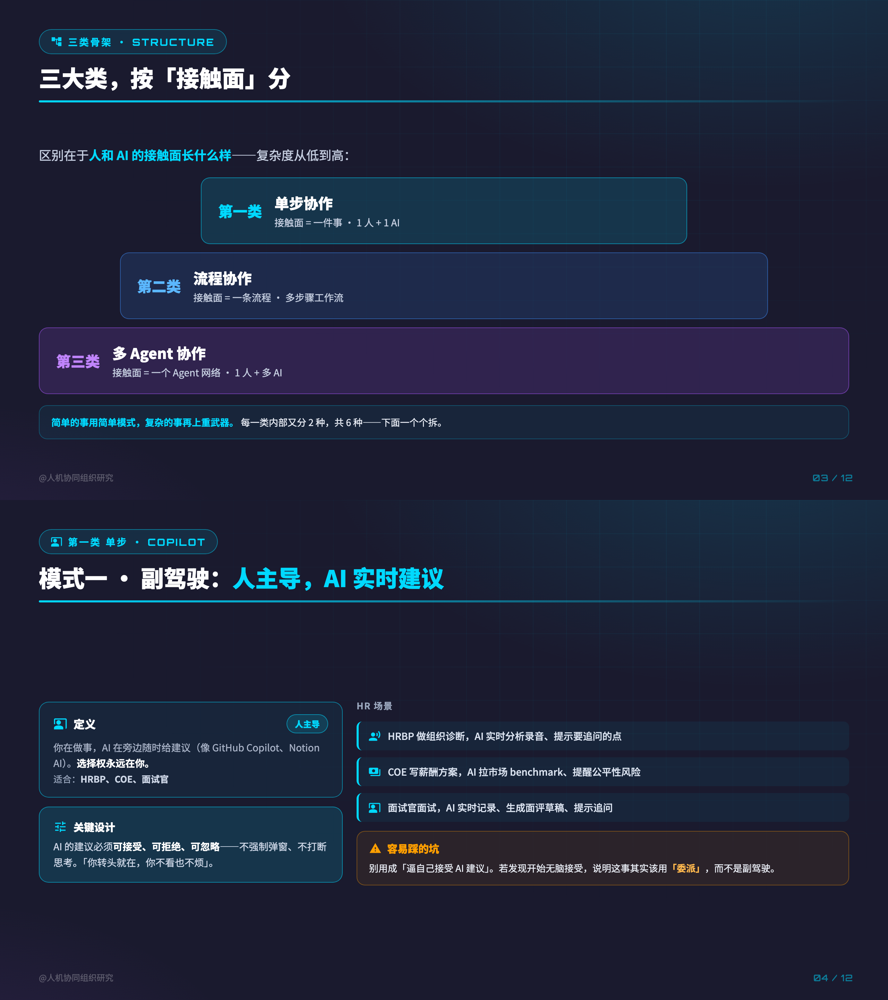
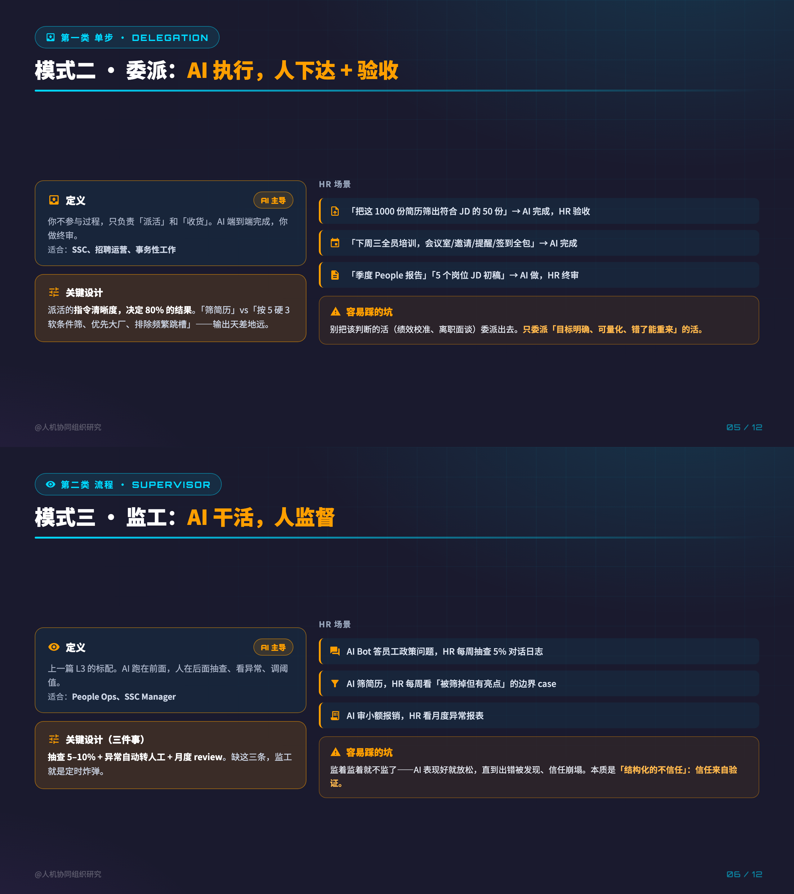
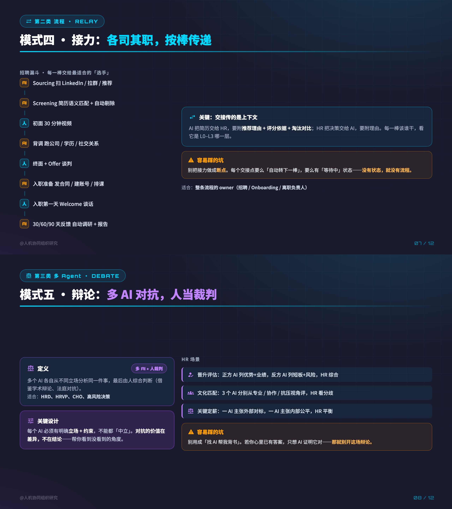

# xhs-ppt

把一篇文章/草稿变成一套 **PNG 卡片**（小红书 / 公众号 / 社交长图）的 Claude Code skill。

核心不是"套模板出图"，而是一条**三段式流程**，逼着先想清楚再渲染：

1. **读原文 → 判属性 → 定配色 + 配图** —— 抽出文章所有核心论点，提炼成能独立读懂的「金句」，按文章气质选一套统一配色。
2. **设计框架 → 出分镜（先给你确认，不动 HTML）** —— 定页数、每页结构、哪页用流程图、哪页用组合图，并做覆盖性校验确保不漏要点。
3. **渲染 → 自检** —— 从已验收样张拷起，HTML→PNG @2x，可两两拼成 2合1 竖卡；最后做「脱稿自检」。

> **北极星：读者不点开原文，光刷完这套卡，就能拿到文章的完整论点、关键证据、结论。** 卡片是原文的「压缩版」，不是预告片。

## 样张 · 科技深色·亮电光青（旗舰配色）

下面是用本 skill 生成的真实卡片（"人机协同 3 类 6 种模式"，16:9 单页两两拼成 2合1 竖卡）：

| | |
|---|---|
|  |  |
|  |  |

完整 12 页的生成脚本与分镜见 [`examples/hr-collab-modes/`](examples/hr-collab-modes/)。

## 安装

本仓库本身就是一个 Claude Code skill 目录。克隆到你的 skills 目录即可：

```bash
git clone https://github.com/MistyWu812/xhs-ppt.git ~/.claude/skills/xhs-ppt
```

依赖：

- **Google Chrome**（headless 渲染 HTML→PNG；macOS 自动探测，其它平台用 `CHROME=/path/to/chrome` 覆盖）
- **Python 3** + `pip install pillow`（仅 2合1 拼接 `stack_cards.py` 用到）
- 旗舰配色用到 Google Fonts（Orbitron）+ Material Icons，**需联网**；离线请改用 `tech-navy`（智谱深蓝，纯 SVG）。

## 用法

在 Claude Code 主对话里，把文章贴给它或给出文件路径，然后说：

```
用 xhs-ppt 把这篇渲染成科技风 2合1 卡片
```

触发词："渲染卡片"、"生成 PPT"、"出图"、"做卡片"、"科技风出图"、"2合1"、"用 xhs-ppt"。

它会按三段式走：先给你一句属性+配色判断 → 出分镜让你确认 → 确认后才渲染并自检。

### 也可以直接用脚本

```bash
# 1. 写若干 slideNN.html（从 templates/tech-cyan/_skeleton.html 拷，或用 _starter.py 批量生成）
# 2. 渲染 @2x
python3 tools/render_cards.py path/to/slides 1280x720 2     # 16:9 单页
python3 tools/render_cards.py path/to/slides 1080x1440 2    # 9:16 竖卡（小红书默认）
# 3. 两两拼成 2合1 竖卡
BG=#1a1a2e python3 tools/stack_cards.py --pairs path/to/slides 2up
# 长图文（整篇=一张超长图，HTML 内写 <!-- render-size: 1080x4500 -->）
python3 tools/render_longform.py path/to/file.html
```

## 配色与比例

| 配色 | 场景 | 位置 |
|---|---|---|
| 科技深色·亮电光青（旗舰） | 观点强 / AI·产品向 / 体系分层 | `templates/tech-cyan/` |
| 智谱深蓝（离线安全，纯 SVG） | 同上但需离线 / 更稳重 | `templates/tech-navy/` |
| 专业蓝绿 / 暖中性 / 极简黑（浅色家族） | HR 方法论 / 故事 / 单点暴论 | token 见 `SKILL.md` |

比例：9:16 竖卡 `1080×1440`（小红书默认）/ 16:9 单页 `1280×720` / 2合1 竖卡 `1280×1440`，一律 @2x。

## 目录结构

```
xhs-ppt/
├── SKILL.md                  ← skill 指令（三段式流程 + 配色库 + 组件库 + 红线）
├── tools/
│   ├── render_cards.py       ← HTML→PNG（Chrome headless，等 Web 字体，@2x）
│   ├── stack_cards.py        ← 多张 PNG 上下拼成 2合1 竖卡
│   └── render_longform.py    ← 整篇渲成一张超长图
├── templates/
│   ├── tech-cyan/            ← 旗舰：_skeleton / _components(九件套) / _starter.py / slide01–11 范例 / 样张
│   └── tech-navy/            ← 智谱深蓝：6 张 HR 卡范例 + 样张
└── examples/
    └── hr-collab-modes/      ← 完整 worked example：_gen.py + _storyboard.md + 6 张 2合1 成图
```

## 九大组件

封面 HERO ｜ 组合图·逐层详解 ｜ ✗vs✓ 对比卡 ｜ 关键/红线框 ｜ L0–L3 阶梯 ｜ 流程卡(箭头链) ｜ 全景表 ｜ 总结 2×2+金句条 ｜ 痛点二选一。真实片段在 `templates/tech-cyan/_components.html`，编号对应分镜。

## License

[MIT](LICENSE) © 2026 MistyWu812
